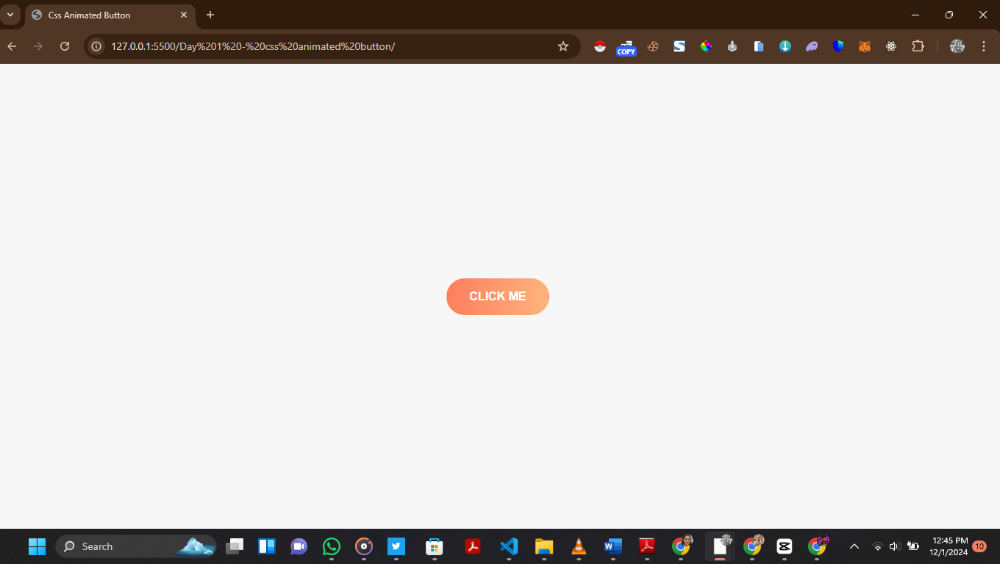

# CSS Animated Button

### 🌟 **Features**
- 🎨 Gradient background with a smooth transition effect.
- 🖱️ Interactive hover effect with a darker gradient.
- 🔲 Subtle focus shadow for enhanced accessibility.

---

### 🛠️ **Code Explanation**

#### **HTML Structure**
```html
<button class="btn"></button>
```
- The `button` element styled using the `.btn` class.

#### **CSS Styling**
- **Default State**
```css
background-image: linear-gradient(to right, #ff7e5f, #feb47b);
color: white;
border-radius: 30px;
```
- **Hover State**
```css
background-image: linear-gradient(to right, #d04e3b, #d97a4d);
border-color: #d04e3b;
```
- **Focus State**
```css
box-shadow: 0 0 10px rgba(255, 120, 95, 0.8);
```

---

### 🖥️ **How to Use**
1. 📁 Save the HTML and CSS code in a file named `index.html`.
2. 🌐 Open the file in your favorite web browser.
3. 🖱️ Hover over the button to see the interactive effects.

---

### ✏️ **Customization**
- 🎨 Change the gradient colors in the `.btn` and `.btn:hover` states.
- 📏 Adjust `padding`, `font-size`, and `border-radius` for size customization.
- ✨ Modify `box-shadow` in `.btn:focus` for a unique focus effect.

---

### 📷 **Preview**
_Add a screenshot or GIF of the animated button in action._


---

### 📜 **License**
This project is open-source under the **MIT License**.  
Feel free to use, modify, and share it.

---

### 👨‍💻 **Author**
Developed by [DevDavix](https://github.com/devdavix2).  
Explore more projects on [Portfolio](https://devdavixx.vercel.app/).
```